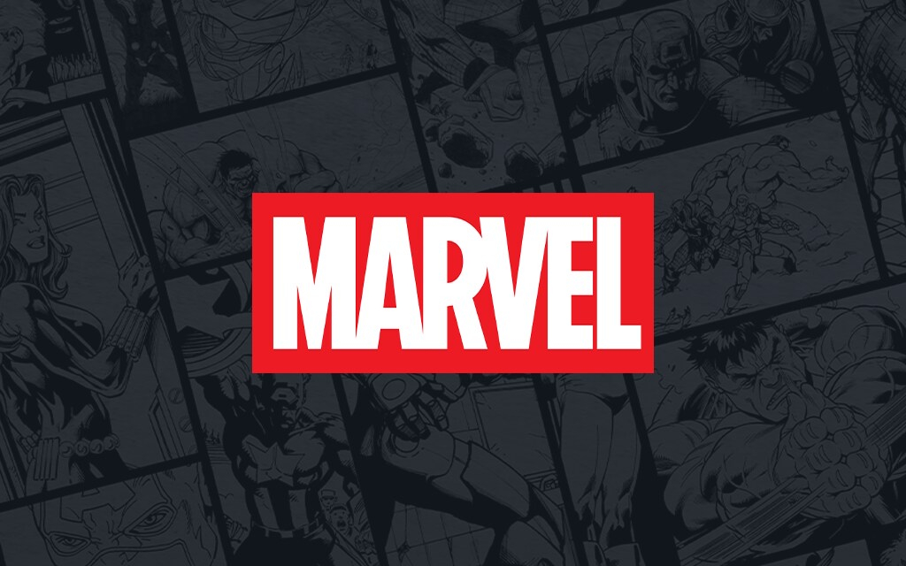

# 🎬 Marvel Movies App


A comprehensive database app for Marvel movie fans, featuring an offline-first architecture and sleek UI.

<p align="center">
  
</p>

## ✨ Features

- **Complete Marvel Universe**: Browse all Marvel movies across MCU, X-Men, Sony Spider-Man, and other franchises
- **Rich Movie Details**: View posters, ratings, cast, and more through integration with OMDb API
- **Smart Filtering**: Filter by franchise, sort by various criteria, and search for specific titles
- **Offline Support**: Continue browsing even without an internet connection
- **Responsive Design**: Works beautifully on mobile, tablet, and desktop devices

## 🚀 Technical Highlights

- **Modern React**: Built with React 19 using functional components and hooks
- **Offline-First Architecture**: Service Worker + IndexedDB for reliable offline experience
- **Progressive Web App**: Installable on mobile and desktop devices
- **Optimized Performance**: 
  - Lazy loading of images
  - Batch processing of API requests
  - Local caching of movie data and posters
- **Beautiful Animations**: Smooth transitions and motion effects using Framer Motion

## 🛠️ Tech Stack

- **Frontend**: React, React Router
- **Styling**: Styled Components
- **Animations**: Framer Motion
- **State Management**: React Hooks (useState, useEffect, useRef)
- **API Integration**: OMDb API
- **Offline Storage**: IndexedDB, Service Worker Caching
- **Build Tools**: Create React App

## 📋 Installation & Setup

1. **Clone the repository**
   ```bash
   git clone https://github.com/yourusername/marvel-movies-app.git
   cd marvel-movies-app
   ```

2. **Install dependencies**
   ```bash
   npm install
   ```

3. **Get an OMDb API Key**
   - Visit the [OMDb API website](https://www.omdbapi.com/apikey.aspx)
   - Fill out the form to request a FREE API key
   - Check your email and click the verification link
   - Your API key will be activated and displayed in the confirmation page

4. **Environment Setup**
   Create a `.env` file in the root directory with your OMDb API key:
   ```
   REACT_APP_OMDB_API_KEY=your_omdb_api_key
   ```

5. **Start the development server**
   ```bash
   npm start
   ```

6. **Build for production**
   ```bash
   npm run build
   ```

## 🔍 Code Structure

- **`/src`**: Main source code
  - **`/components`**: Reusable UI components
  - **`/pages`**: Page components (Home, MovieDetails)
  - **`/hooks`**: Custom React hooks
  - **`/services`**: API service integrations
  - **`/utils`**: Helper utilities 
  - **`/data`**: Static data (movie list)
  - **`/styles`**: Global styles and theme

## 🧪 Testing & Linting

- **Run linter**
  ```bash
  npm run lint
  ```

- **Fix linting issues**
  ```bash
  npm run lint:fix
  ```

## 🌟 Future Enhancements

- Timeline view for chronological movie ordering
- User accounts with favorite movies and watchlists
- Integration with additional APIs for more comprehensive data
- Dark/Light theme toggle
- Advanced filtering options (directors, actors, etc.)

## 📄 License

This project is for educational purposes only and is not affiliated with Marvel Studios, Disney, or any other movie studios. All movie information is provided through the OMDb API.
